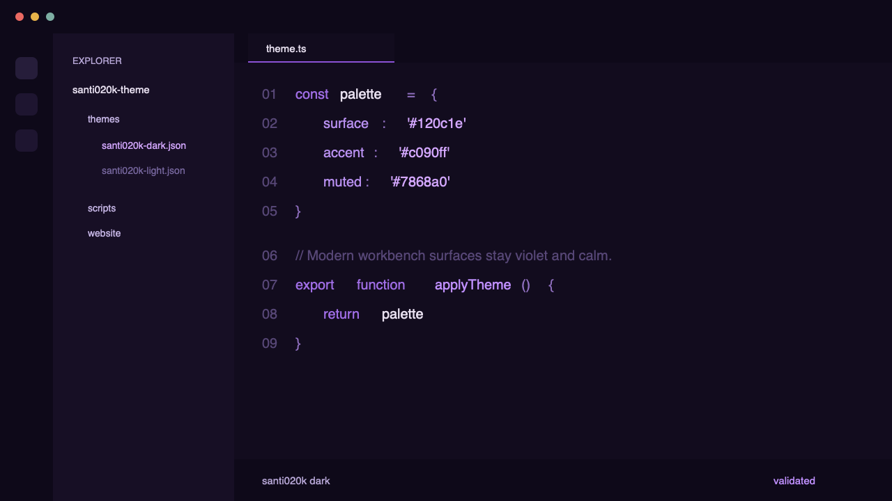
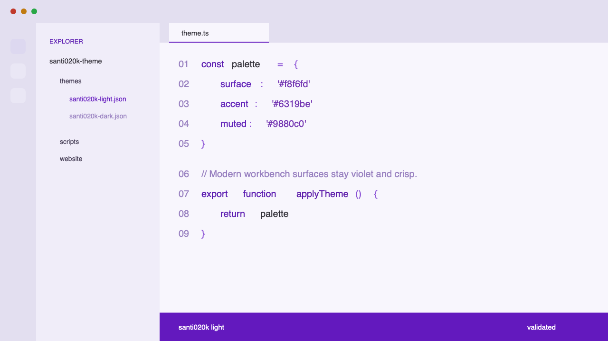
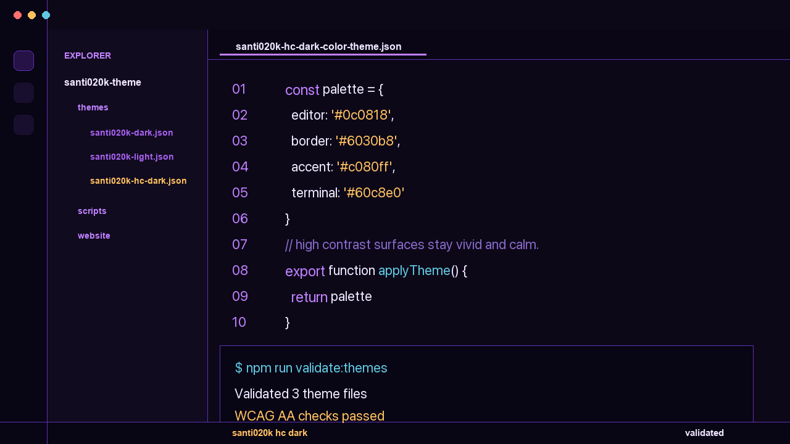

# Santi020k Theme

[](https://marketplace.visualstudio.com/items?itemName=santi020k.santi020k-theme)
[](https://open-vsx.org/extension/santi020k/santi020k-theme)
[](https://github.com/santi020k/santi020k-theme/actions/workflows/validate.yml)

A deep indigo-black dark, a purple-tinted light, and a near-black high contrast dark theme for VS Code — built for long sessions, not just screenshots.

**→ [theme.santi020k.com](https://theme.santi020k.com)**

---







---

## Why this theme

- **Purple-forward, not purple-loud.** Every accent — cursor, brackets, active borders — comes from a single violet ramp. Nothing neon, nothing clashing.
- **Three variants, one color language.** Dark, light, and high contrast all share the same violet palette so switching between them feels intentional, not jarring.
- **Built for readability.** Contrast ratios are validated automatically on every commit. Keywords are italic, comments are softened, JSON keys / values / numbers use distinct hues so structure is obvious at a glance.
- **Works everywhere.** VS Code, Cursor, Windsurf, VSCodium — any editor built on the VS Code extension API.

---

## Install

**VS Code Marketplace** — the fastest way:

1. Open VS Code → Extensions (`Cmd+Shift+X` / `Ctrl+Shift+X`)
2. Search **Santi020k Theme**
3. Click **Install**
4. Open the theme picker (`Cmd+K Cmd+T`) and choose **santi020k dark**, **santi020k dark bold**, **santi020k light**, or **santi020k hc dark**

### Achieving the "Preview Look"
The marketing website uses **Montserrat** at weight **700 (Bold)** with **1.9 line height**. To get that exact look in VS Code, add these to your `settings.json`:

```json
{
  "editor.fontFamily": "'Montserrat', 'JetBrains Mono', monospace",
  "editor.fontWeight": "700",
  "editor.lineHeight": 1.9,
  "editor.letterSpacing": -0.2
}
```

**Open VSX** — for Cursor, VSCodium, and other compatible editors:

Install from [open-vsx.org/extension/santi020k/santi020k-theme](https://open-vsx.org/extension/santi020k/santi020k-theme), then pick the variant from the theme picker.

---

## Variants

### santi020k dark

Deep indigo-black (`#110c1d`) backgrounds with a layered surface hierarchy. Accent colors are muted violets pulled directly from the wallpaper geometry — nothing neon, nothing loud. Keywords and storage modifiers are italic; comments are softened but readable. The cursor and active tab indicator glow in `#945df4`.

| Role | Color |
|---|---|
| Editor background | `#110c1d` |
| Activity / Status bar | `#0b0712` |
| Sidebar | `#1c1528` |
| Cursor / active border | `#945df4` |
| Buttons / badges | `#5a0fdb` |
| Strings | `#b48df7` |
| Keywords | `#8445f2` italic |
| Comments | `#71569f` italic |
| Primary text | `#dfdde3` |

### santi020k dark bold

The "website preview" version of the dark theme. It shares the exact same palette as `santi020k dark` but explicitly sets **bold** weight for every syntax token. When combined with a bold font, it delivers the high-impact, punchy aesthetic seen in the marketing previews.

| Role | Style |
|---|---|
| Palette | Identical to `santi020k dark` |
| Syntax Tokens | **Bold** (global override) |
| Keywords | **Bold Italic** |
| Function Names | **Bold** |

### santi020k light bold

The bold counterpart to the light theme. It applies a global bold override to all syntax tokens, making the violet ramp even more prominent against the soft lavender backgrounds.

| Role | Style |
|---|---|
| Palette | Identical to `santi020k light` |
| Syntax Tokens | **Bold** |
| Keywords | **Bold Italic** |

### santi020k light

Purple-tinted whites (`#f8f6fd`) with a rich violet brand (`#6319be`) driving all interactive elements. The status bar flips to solid brand purple, making workspace context immediately readable. Syntax uses a single-hue violet ramp so the light variant feels like a natural counterpart to the dark one.

| Role | Color |
|---|---|
| Editor background | `#f8f6fd` |
| Sidebar | `#f0edf9` |
| Tab bar | `#e3dff0` |
| Status bar | `#6319be` |
| Cursor / active border | `#6319be` |
| Strings | `#7030b0` |
| Keywords | `#5a1ab0` italic |
| Comments | `#9880c0` italic |
| Primary text | `#302e36` |

### santi020k hc dark

Near-black (`#0d0718`) backgrounds with vivid purple borders (`#602cba`) replacing the subtle ones from the dark variant. All accent colors are fully saturated — teal `#60c8e0`, amber `#ffc060`, red `#ff7070` — so every signal reads clearly at a glance. Indent guides are made visible. Built for screens with limited contrast, accessibility requirements, or anyone who prefers maximum separation between UI elements.

| Role | Color |
|---|---|
| Editor background | `#0d0718` |
| Activity / Status bar | `#090410` |
| Sidebar | `#140b22` |
| Borders | `#602cba` |
| Cursor / active border | `#a570ff` |
| Strings | `#c5a3ff` |
| Keywords | `#955ff2` italic |
| Comments | `#8264b4` italic |
| Primary text | `#f0ebfa` |

---

## Contributing

See [CONTRIBUTING.md](CONTRIBUTING.md) for setup, editing themes, validation, and the release workflow.

## Support

If this theme makes your editor a nicer place to live, you can support ongoing maintenance through [GitHub Sponsors](https://github.com/sponsors/santi020k).

---

## License

[MIT](LICENSE)
