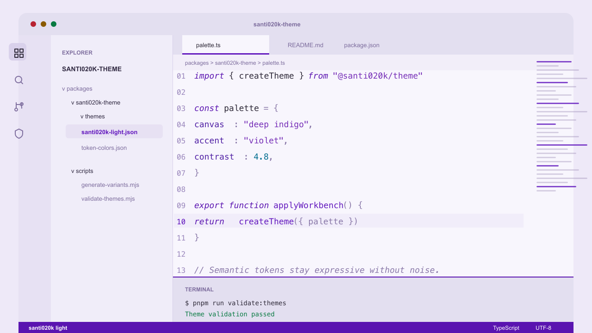
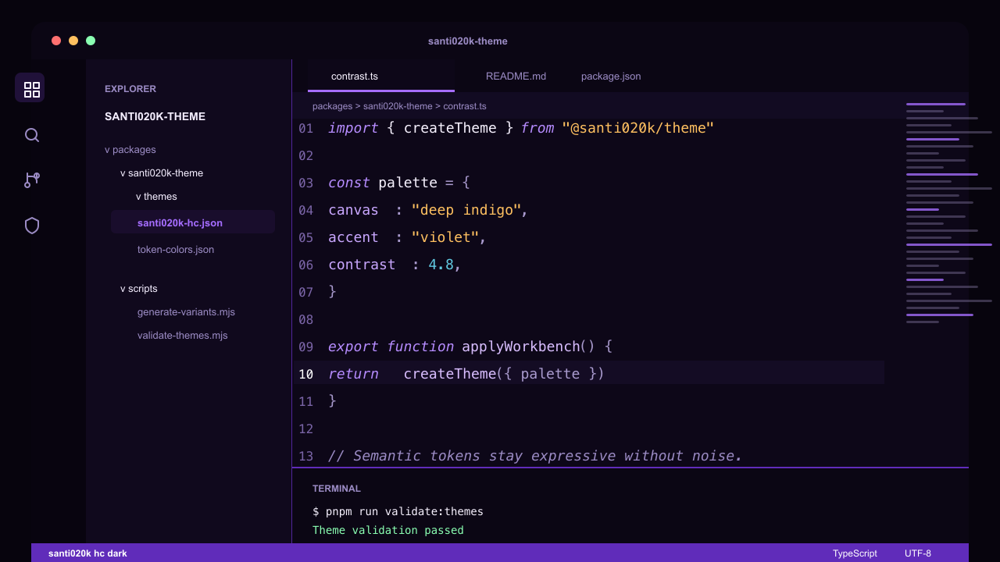
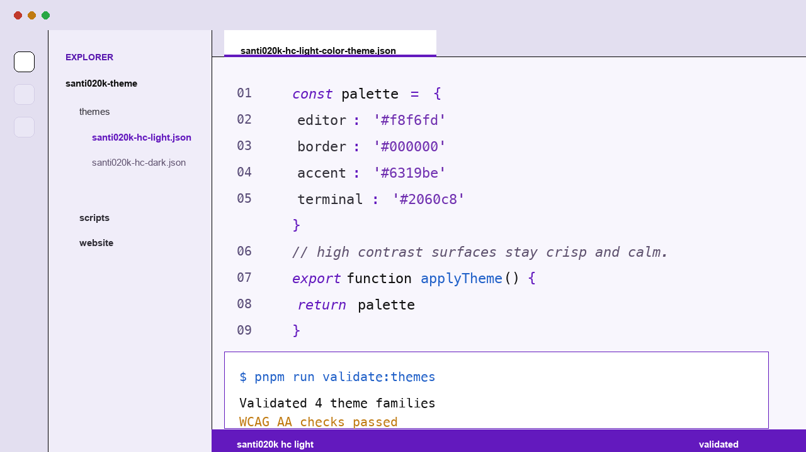

<p align="center">
  
</p>

<h1 align="center">Santi020k Theme</h1>

<p align="center">Calm contrast and a consistent violet language across your tools.</p>

Monorepo for the Santi020k Theme family: a calm violet theme system spanning VS Code, Zed, Chrome, Codex, JetBrains IDEs, Raycast, Slack, Xcode, terminals, shared brand packages, and static product websites.

[Theme family](https://theme.santi020k.com) ·
[VS Code](https://theme.santi020k.com/vscode/) ·
[Terminal](https://theme.santi020k.com/terminal/) ·
[npm](https://www.npmjs.com/package/@santi020k/theme) ·
[Documentation](docs/brand-guidelines.md) ·
[Releases](https://github.com/santi020k/santi020k-theme/releases) ·
[Contributing](CONTRIBUTING.md)

<p align="center">
  <a href="https://github.com/santi020k/santi020k-theme/actions/workflows/validate.yml"></a>
  <a href="https://github.com/santi020k/santi020k-theme/actions/workflows/codeql.yml"></a>
  <a href="https://marketplace.visualstudio.com/items?itemName=santi020k.santi020k-theme"></a>
  <a href="https://open-vsx.org/extension/santi020k/santi020k-theme"></a>
  <a href="https://www.npmjs.com/package/@santi020k/theme"></a>
  <a href="LICENSE"></a>
</p>

The brand source of truth is [`docs/brand-guidelines.md`](docs/brand-guidelines.md). Read it before changing colors, product names, screenshots, icons, website copy, store metadata, or shared assets.

**Explore:** [Workspaces](#workspaces) · [Quick Start](#quick-start) · [Common Commands](#common-commands) · [Working On The Theme Family](#working-on-the-theme-family) · [Documentation Map](#documentation-map)

## One palette, your whole workspace

<p align="center">
  <a href="https://theme.santi020k.com/vscode/">
    <picture>
      <source media="(prefers-color-scheme: dark)" srcset="packages/santi020k-theme/assets/previews/preview-dark.png">
      
    </picture>
  </a>
</p>

*Dark and light previews from the theme's generated assets. [Explore every variant →](https://theme.santi020k.com/vscode/)*

| Make it yours | Start here |
| :--- | :--- |
| **VS Code and compatible editors** | [Marketplace](https://marketplace.visualstudio.com/items?itemName=santi020k.santi020k-theme) · [Open VSX](https://open-vsx.org/extension/santi020k/santi020k-theme) · dark, light, high contrast, bold, and italic variants |
| **Your terminal** | [Guided setup](https://theme.santi020k.com/terminal/configure/) · [Installation guide](https://theme.santi020k.com/terminal/docs/) · colors, Starship prompts, and managed shell integration |
| **More tools** | [Zed](https://theme.santi020k.com/zed/) · [Chrome](https://theme.santi020k.com/chrome/) · [Codex](https://theme.santi020k.com/codex/) · [JetBrains](https://theme.santi020k.com/jetbrains/) · [Xcode](https://theme.santi020k.com/xcode/) · [Raycast](https://theme.santi020k.com/raycast/) · [Slack](https://theme.santi020k.com/slack/) |
| **Your own interface** | [Shared tokens and assets](packages/theme/README.md) · [Theme helpers](packages/theme-core/README.md) · [Lumen UI](https://lumen.santi020k.com/) |

<details>
<summary>Compare high-contrast variants</summary>

| High-contrast dark | High-contrast light |
| :---: | :---: |
|  |  |

The high-contrast variants strengthen borders and separation while retaining the violet identity.

</details>

## Workspaces

| Workspace                           | Purpose                                                                                                                        |
| ----------------------------------- | ------------------------------------------------------------------------------------------------------------------------------ |
| `packages/santi020k-theme`          | Published VS Code extension with dark, light, high-contrast, bold, and italic variants                                         |
| `packages/santi020k-chrome-theme`   | Chrome Web Store theme package, synced from the VS Code palette                                                                |
| `packages/santi020k-zed-theme`      | Generated Zed theme family synced from the VS Code palette                                                                     |
| `packages/santi020k-codex-theme`    | Copy-ready ChatGPT-inspired light custom theme preset for Codex                                                                |
| `packages/santi020k-terminal-theme` | Generated terminal color schemes and prompt presets                                                                            |
| `packages/santi020k-raycast-theme`  | Shareable Raycast Theme Studio JSON and one-click dark/light import URLs                                                        |
| `packages/santi020k-slack-theme`    | Paste-ready Slack custom themes with legacy import strings and semantic role maps                                               |
| `packages/santi020k-jetbrains-theme` | Installable dark/light UI and editor theme plugin for JetBrains IDEs and Android Studio                                        |
| `packages/santi020k-xcode-theme`    | Native dark/light Xcode editor and debug-console color themes                                                                   |
| `packages/theme`                    | Public `@santi020k/theme` package for tokens, website CSS, assets, metadata, and Chrome mapping helpers                        |
| `packages/theme-core`               | Public `@santi020k/theme-core` helper package for package-neutral token generation, asset lookup, and site behavior primitives |
| `apps/website`                      | Consolidated theme family site for `theme.santi020k.com`, including every product route and Terminal documentation             |
| `apps/*-website`                    | Product page source modules retained during consolidation; these are composed into `apps/website` and are not deployed separately |

## Quick Start

```bash
pnpm install
pnpm run validate
```

Use the Node minimum declared in [`package.json`](package.json) and pnpm `10.34.6`.

## Common Commands

| Command                         | What it does                                                                                                                  |
| ------------------------------- | ----------------------------------------------------------------------------------------------------------------------------- |
| `pnpm run validate`             | Builds packages, checks spelling, validates themes and marketplace metadata, tests, lints, and packages the VS Code extension |
| `pnpm run validate:themes`      | Validates the VS Code theme JSON files                                                                                        |
| `pnpm run validate:marketplace` | Checks VS Code extension marketplace readiness                                                                                |
| `pnpm run validate:chrome`      | Lints, validates contrast, and dry-runs Chrome packaging                                                                      |
| `pnpm run validate:terminal`    | Validates generated terminal presets                                                                                          |
| `pnpm run validate:zed`         | Builds and checks the generated Zed theme family                                                                              |
| `pnpm run validate:codex`       | Checks that the saved Codex preset exactly matches its supplied values                                                        |
| `pnpm run validate:raycast`     | Regenerates and validates Raycast themes and import URLs                                                                       |
| `pnpm run validate:slack`       | Regenerates and validates Slack themes and legacy import strings                                                              |
| `pnpm run validate:jetbrains`   | Packages and validates the JetBrains/Android Studio plugin                                                                     |
| `pnpm run validate:xcode`       | Regenerates and validates native Xcode color themes                                                                            |
| `pnpm run package:extension`    | Builds and packages the VS Code extension as a VSIX                                                                           |
| `pnpm run package:chrome`       | Builds Chrome Web Store zip files                                                                                             |
| `pnpm run site:dev`             | Starts the consolidated theme-family website on port 4174                                                                     |
| `pnpm run site:build`           | Builds the consolidated website and synchronized product routes                                                               |
| `pnpm run site:preview`         | Previews the consolidated production build locally                                                                            |
| `pnpm run changeset`            | Creates a release changeset                                                                                                   |
| `pnpm run commit`               | Opens the conventional commit prompt                                                                                          |

## Working On The Theme Family

- Start brand-sensitive work in [`docs/brand-guidelines.md`](docs/brand-guidelines.md).
- Keep VS Code dark and light theme changes paired unless the task is explicitly single-variant.
- Keep Chrome manifests synced from the VS Code theme through `pnpm run sync:themes`.
- Keep website copy concrete, developer-facing, and aligned with the published domains.
- Add a changeset for user-visible package, docs, release, website, or theme changes.

## Documentation Map

- [`docs/architecture.md`](docs/architecture.md) explains the repo architecture.
- [`packages/santi020k-theme/README.md`](packages/santi020k-theme/README.md) is the marketplace-facing VS Code extension README.
- [`packages/santi020k-chrome-theme/README.md`](packages/santi020k-chrome-theme/README.md) covers Chrome theme development and Web Store packaging.
- [`packages/santi020k-codex-theme/README.md`](packages/santi020k-codex-theme/README.md) documents the saved Codex preset.
- [`packages/santi020k-raycast-theme/README.md`](packages/santi020k-raycast-theme/README.md), [`packages/santi020k-slack-theme/README.md`](packages/santi020k-slack-theme/README.md), [`packages/santi020k-jetbrains-theme/README.md`](packages/santi020k-jetbrains-theme/README.md), and [`packages/santi020k-xcode-theme/README.md`](packages/santi020k-xcode-theme/README.md) document the additional application ports.
- [`packages/theme/README.md`](packages/theme/README.md) documents shared tokens and assets.
- [`packages/theme-core/README.md`](packages/theme-core/README.md) documents lower-level shared helper APIs.
- [`apps/website/README.md`](apps/website/README.md) and [`apps/website/WEBSITE.md`](apps/website/WEBSITE.md) cover the consolidated static site.

## Find your next step

| Resource | Use it for |
| --- | --- |
| [Brand guidelines](docs/brand-guidelines.md) | Canonical identity and cross-surface conventions. |
| [Architecture](docs/architecture.md) | Package responsibilities and runtime boundaries. |
| [Contributing](CONTRIBUTING.md) | Contributor setup and validation workflow. |
| [Security policy](SECURITY.md) | Private vulnerability reporting and support boundaries. |

## Feedback and community

Found a hard-to-read token or a platform mismatch? [Report a bug](https://github.com/santi020k/santi020k-theme/issues/new?template=bug_report.yml) with your app version, theme variant, steps, and a screenshot without private content. [Suggest an improvement](https://github.com/santi020k/santi020k-theme/issues/new?template=feature_request.yml) or [browse existing issues](https://github.com/santi020k/santi020k-theme/issues) before opening a duplicate.

Please report vulnerabilities privately using the [security policy](SECURITY.md).

## License

MIT. See [LICENSE](LICENSE). Created and maintained by [Santiago Molina](https://santi020k.com).
