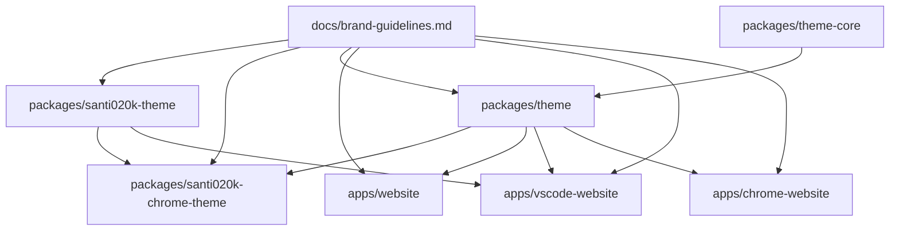

# Santi020k Theme Architecture

This repository is a single pnpm workspace and a single Turbo graph for the Santi020k Theme family. It ships editor themes, browser themes, shared design-system packages, and static product websites from one lockfile.

The brand source of truth is [`brand-guidelines.md`](brand-guidelines.md). Architecture choices should keep the VS Code theme, Chrome theme, shared packages, and websites moving together without coupling every release or deployment.

## Decision

Use one root monorepo with two kinds of workspaces:

- `packages/*` are distributable theme artifacts and package-specific tooling.
- `apps/*` are deployable websites.
- shared libraries live under `packages/*` when at least two surfaces need the same tokens, assets, or helpers.

Each future public theme surface should follow this pairing:

| Surface | Theme package | Website app |
| --- | --- | --- |
| Theme hub | none | `apps/website` |
| VS Code | `packages/santi020k-theme` | `apps/vscode-website` |
| Chrome | `packages/santi020k-chrome-theme` | `apps/chrome-website` |
| iTerm2 | `packages/santi020k-iterm-theme` | `apps/iterm-website` |
| Shared brand assets | `packages/theme` / `packages/theme-core` | none |
| Future surface | `packages/santi020k-<surface>-theme` | `apps/<surface>-website` |

## Workspace Map

| Workspace | Kind | Purpose |
| --- | --- | --- |
| `packages/santi020k-theme` | Published VS Code extension | Owns VS Code `package.json`, marketplace metadata, theme JSON files, validation scripts, VSIX packaging, and Visual Studio Marketplace/Open VSX publishing. |
| `packages/santi020k-chrome-theme` | Chrome Web Store theme package | Owns Chrome manifests, browser-theme generation, Web Store packaging, Chrome-specific validation, store copy, and store media. |
| `packages/santi020k-iterm-theme` | Generated terminal presets | Owns the dark and light palette source, `.itermcolors` generation, and preset validation. |
| `packages/theme` | Public shared package | Public entry point for reusable Santi020k tokens, website CSS variables, typography variables, assets, project metadata, and Chrome color mapping helpers. Most consumers should use this package. |
| `packages/theme-core` | Public low-level helper package | Package-neutral types, token CSS generation helpers, asset manifest helpers, and shared browser behavior used by `@santi020k/theme`. Use directly only when building shared packages or lower-level tooling. |
| `apps/website` | Static Astro app | Theme family hub for `theme.santi020k.com`. Links the VS Code, Chrome, npm, and future surfaces together. |
| `apps/vscode-website` | Static Astro app | Product page for the VS Code extension at `vscode.santi020k.com`, including Marketplace/Open VSX install paths and preview assets. |
| `apps/chrome-website` | Static Astro app | Product page for the Chrome browser theme at `chrome.santi020k.com`, including Chrome Web Store install paths and browser previews. |
| `apps/iterm-website` | Static Astro app | Product page for the iTerm2 presets at `iterm.santi020k.com`, including downloads, terminal previews, and install instructions. |

## Dependency Flow

The dependency direction should stay one-way from product surfaces toward shared packages:

Rules:

- Product websites should depend on `@santi020k/theme`, not `@santi020k/theme-core`.
- Theme packages can depend on `@santi020k/theme` when they need public tokens, assets, or color-mapping helpers.
- `@santi020k/theme` can depend on `@santi020k/theme-core`.
- `@santi020k/theme-core` must remain package-neutral and should not import product packages or apps.
- Apps must not become sources of truth for package assets or published metadata.

## Shared Token And Asset Layers

There are two shared package layers by design:

### `@santi020k/theme`

This is the public design-system package. It owns:

- `@santi020k/theme` for JavaScript metadata, token data, asset lookup, project metadata, and Chrome color helpers.
- `@santi020k/theme/tokens.css` for raw HSL CSS custom properties and Tailwind v4 `@theme` mappings.
- `@santi020k/theme/site.css` for website-ready CSS color variables such as `--theme-bg`, `--surface`, `--ink`, `--brand`, `--accent`, and shared typography variables.
- `@santi020k/theme/site` for shared website behavior helpers such as theme toggling and navigation state.
- `@santi020k/theme/typography.css` for shared Montserrat font-family variables.
- `@santi020k/theme/assets/*` for reusable logos, favicons, wallpapers, previews, and package assets.

Use `site.css` in the product websites because those apps use `var(--ink)` and `var(--surface)` as CSS-ready colors. Use `tokens.css` when a consumer wants raw HSL channels and Tailwind mappings.

The hub site has small palette offsets. It opts into those through `data-santi020k-site="hub"` on the root element instead of copying the full palette locally.

### `@santi020k/theme-core`

This is the low-level helper layer. It owns:

- shared TypeScript declaration shapes for token and asset manifests;
- token CSS and Tailwind theme generation utilities;
- asset lookup helpers;
- shared site behavior primitives re-exported publicly by `@santi020k/theme/site`.

Most app and package code should not import this package directly. Prefer the public `@santi020k/theme` facade unless you are changing the shared helper implementation itself.

## Source Of Truth Boundaries

Use these files as the primary ownership locations:

| Concern | Source of truth |
| --- | --- |
| Brand names, voice, palette rules, asset rules | `docs/brand-guidelines.md` |
| VS Code workbench and syntax colors | `packages/santi020k-theme/themes/` and theme generation scripts |
| Shared website-ready variables | `packages/theme/site.css` |
| Shared raw token data | `packages/theme/tokens/tokens.json` and generated token CSS |
| Chrome color mappings | `packages/theme` Chrome helper exports plus Chrome package manifests |
| Chrome store copy and publishing notes | `packages/santi020k-chrome-theme/store/` |
| Website copy, SEO, and website-only public assets | Owning `apps/*` workspace |
| Root orchestration scripts | Root `package.json` |

## Why One Root Turbo

One root Turbo graph keeps dependency caching, CI filtering, lockfile management, and developer commands simple. Nested Turbo repos would duplicate package manager state, make cross-theme asset sharing harder, and blur whether a command should run from the root or from a subproject.

Workspace-local scripts still provide the isolation we want:

- each package owns its own `build`, `validate`, `package`, and sync scripts;
- each app owns its own `dev`, `build`, and `preview` scripts;
- the root `validate` command orchestrates release readiness across all workspaces.

## Ownership Rules

- Put store manifests, publish assets, zipping scripts, and package validation in `packages/<surface>-theme`.
- Put marketing pages, static website assets, SEO metadata, and site-specific Astro config in `apps/<surface>-website`.
- Keep package/app-owned scripts and tests inside the owning workspace; root commands should orchestrate workspace scripts.
- Put only truly shared cross-project tooling at the root.
- Add reusable libraries under `packages/<name>` only when at least two workspaces need the same code.
- Keep shared design tokens and reusable assets in `packages/theme`; use `packages/theme-core` for package-neutral token and asset manifest helpers.
- Keep app-local CSS for layout, composition, and surface-specific effects. Move repeated color, typography, and site behavior primitives into `@santi020k/theme`.

## Website Architecture

The product websites are intentionally plain Astro apps with static HTML, CSS, and JavaScript:

- `src/pages/index.astro` owns metadata, JSON-LD, first-render theme bootstrapping, and page structure.
- `src/styles.css` owns layout and site-specific component styling.
- `src/main.js` owns small browser behaviors.
- `public/` owns website-only deploy assets such as social images, screenshots, favicons, wallpapers, and robots/sitemap files.

Shared website behavior comes from `@santi020k/theme/site`:

- persisted dark/light theme selection;
- preferred color-scheme sync;
- theme toggle state;
- responsive navigation open/close state;
- shared media query constants.

Shared website colors and fonts come from `@santi020k/theme/site.css`. Apps may add variables for local effects, such as Chrome hero gradients or editor preview token colors, but should not duplicate the base `--theme-bg`, `--surface`, `--ink`, `--brand`, `--accent`, or typography stacks.

Website deployment output is always the owning app's `dist/` directory.

## Theme Package Architecture

The VS Code extension package is the lead product surface. Its themes live in `packages/santi020k-theme/themes/`, with scripts in `packages/santi020k-theme/scripts/` generating, formatting, validating, packaging, and publishing the extension.

Keep these behaviors package-owned:

- theme JSON generation and variant generation;
- workbench, TextMate, semantic token, and contrast validation;
- marketplace readiness checks;
- VSIX packaging;
- release tagging and Marketplace/Open VSX publishing.

The Chrome package is a sibling surface that maps the same palette into browser chrome. It should use the shared Chrome helpers from `@santi020k/theme`, read the VS Code theme palette where needed, and keep Chrome manifests plus store assets inside `packages/santi020k-chrome-theme`.

## CI And Release Boundaries

- Validation can run from the root because it proves the whole workspace still composes.
- Release publishing should stay package-driven through Changesets and only run when package/release paths change.
- Website deployment should be app-specific. A hub-only change should not deploy the VS Code or Chrome sites, and a Chrome package-only change should not deploy a website unless assets or website copy changed.

## Versioning

- `packages/santi020k-theme` uses Changesets. A v2 launch is represented by a major changeset, then the release PR updates the package version, changelog, and VS Code website `softwareVersion`.
- `packages/theme` and `packages/theme-core` use Changesets for public package changes such as new exports, token changes, or asset manifest changes.
- `packages/santi020k-chrome-theme` is private but its Chrome Web Store manifests are release artifacts. Keep `package.json`, `manifest.json`, and `manifest-light.json` on the same version before packaging.
- `apps/*` are private deployable websites. Their package versions are workspace metadata, not public theme versions.

Recommended workflow split:

- `validate.yml`: root validation for PR confidence.
- `release.yml`: Changesets and marketplace publishing for package/release changes only.
- `deploy-websites.yml`: Cloudflare Pages direct-upload deployments for `theme.santi020k.com`, `vscode.santi020k.com`, `chrome.santi020k.com`, and `iterm.santi020k.com`, with one path-filtered job per app.

Cloudflare deployment uses repository secrets `CLOUDFLARE_API_TOKEN` and `CLOUDFLARE_ACCOUNT_ID`, plus repository variables `CLOUDFLARE_PAGES_PROJECT_THEME_HUB`, `CLOUDFLARE_PAGES_PROJECT_VSCODE`, `CLOUDFLARE_PAGES_PROJECT_CHROME`, and `CLOUDFLARE_PAGES_PROJECT_ITERM`.

## Naming

Keep names literal and boring:

- package: `santi020k-<surface>-theme`
- website app: `@santi020k/santi020k-<surface>-theme-website`
- root scripts: `site:<surface>:dev`, `site:<surface>:build`, `site:<surface>:preview`

The hub keeps the shorter package name `@santi020k/santi020k-theme-website` because it owns `theme.santi020k.com`.
The shared npm token package uses the shorter scoped name `@santi020k/theme` because it is not tied to one extension surface.

## Adding A New Surface

When adding a new public theme surface:

1. Add `packages/santi020k-<surface>-theme` if the surface has a packaged artifact.
2. Add `apps/<surface>-website` if the surface needs a public product page.
3. Put reusable palette, assets, and shared browser behavior in `@santi020k/theme` only after a second workspace needs them.
4. Keep low-level helpers in `@santi020k/theme-core` only when they are package-neutral.
5. Add root scripts following `site:<surface>:dev`, `site:<surface>:build`, and `site:<surface>:preview`.
6. Add validation or release commands at the root only when they orchestrate workspace-owned scripts.
7. Add a changeset for public package, website, theme, or docs changes.

## Validation Strategy

Run the narrowest useful check first, then broaden when the change crosses workspace boundaries:

| Change type | Preferred check |
| --- | --- |
| Shared package exports or token CSS | `pnpm --filter @santi020k/theme run build` plus affected app builds |
| VS Code theme JSON or extension metadata | `pnpm run validate:themes` and `pnpm run validate:marketplace` |
| Chrome manifests, Chrome mappings, or store package changes | `pnpm run validate:chrome` |
| Website-only changes | owning `site:*:build` script |
| Cross-surface or release-ready changes | `pnpm run validate` |

If pnpm policy checks block local script execution, document the exact policy failure and run direct equivalent checks where practical, such as package entrypoint syntax checks and direct Astro builds from the affected apps.

Run full validation before publishing any package or store artifact. Release scripts may repeat validation near the publish step, but the first publish action should not run until the workspace has already passed the release-ready gate.
