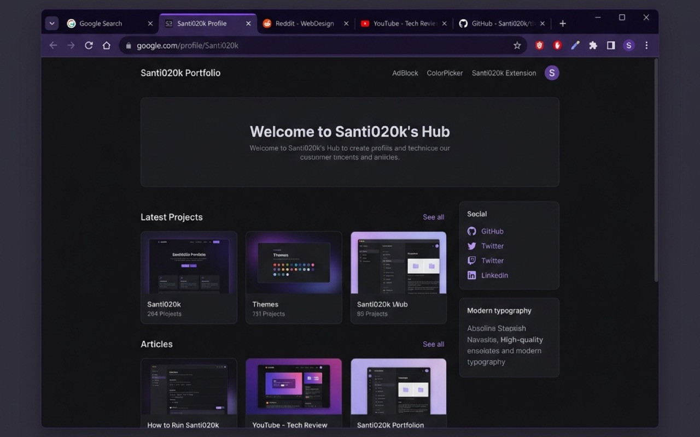

# Santi020k Theme (Chrome)

[](https://github.com/santi020k/santi020k-theme/actions/workflows/validate.yml)
[](https://github.com/santi020k/santi020k-theme/tree/main/packages/santi020k-chrome-theme)
[](https://nodejs.org)
[](LICENSE)



Chrome browser theme matching the palette of **[santi020k VS Code theme](https://github.com/santi020k/santi020k-theme)** — deep violet chrome (`#0d0a15`, `#151221`), editor-like surfaces, and violet accents (`#752df0` / `#945df4`).

This package lives in the Santi020k theme monorepo alongside the VS Code extension, while Chrome Web Store packaging and listings stay independent.

## Install

**From the Chrome Web Store**:

- [Install Santi020k Theme (Dark)](https://chromewebstore.google.com/detail/cljcifjjgolaplmemjcnjhkjfoneadgj)
- [Install Santi020k Theme (Light)](https://chromewebstore.google.com/detail/ekehaoadgcihpkajlnbpkankaginojci?utm_source=item-share-cb)

**Unpacked (developer)**:

1. Open Chrome → **Extensions** (`chrome://extensions`).
2. Enable **Developer mode**.
3. Click **Load unpacked** and select `packages/santi020k-chrome-theme`.

## Development

```bash
pnpm install

pnpm --filter @santi020k/santi020k-chrome-theme-website run dev      # Preview the Chrome website
pnpm --filter @santi020k/santi020k-chrome-theme-website run build    # Production website build
pnpm --filter santi020k-chrome-theme run validate                    # Validate manifests + dry-run package
pnpm --filter santi020k-chrome-theme run sync                        # Sync colors + regenerate NTP images
pnpm --filter santi020k-chrome-theme run package                     # Build dist/*.zip for the Web Store
pnpm --filter santi020k-chrome-theme run package:dry                 # Validate only, no zip written
pnpm --filter santi020k-chrome-theme run publish:webstore            # Submit packaged zips to Chrome Web Store
pnpm --filter santi020k-chrome-theme run release                     # Package and submit both Web Store listings
```

### Sync from VS Code theme

When the VS Code palette changes, run:

```bash
pnpm run sync:themes
```

This reads the VS Code theme files from `packages/santi020k-theme/themes/` through the shared `@santi020k/theme` Chrome token mapping and updates both `manifest.json` and `manifest-light.json`. Validation fails if either Chrome manifest drifts from those centered theme tokens.

## Palette

| Role | Hex | VS Code token |
|------|-----|---------------|
| Frame (title bar) | `#0d0a15` | `titleBar.activeBackground`, `activityBar.background` |
| Toolbar / tab strip | `#151221` | `sideBar.background` |
| Inactive tabs | `#0d0a15` | `tab.inactiveBackground` |
| Active tab accent line | `#752df0` | `tab.activeBorder` |
| NTP / omnibox surface | `#0d0a15` | `editor.background` |
| Separators / controls | `#231d30` | `activityBar.border`, `tab.border` |
| Primary text | `#dfdde3` | `editor.foreground`, `foreground` |
| Muted text (inactive tabs) | `#a19da8` | between `icon.foreground` and line numbers |
| Tab text inactive (unfocused) | `#8d8896` | `tab.inactiveForeground` |
| Links / accents | `#945df4`, `#b48df7` | `textLink.foreground`, `textLink.activeForeground` |
| Incognito frame | `#09070f` | derived from frame, darkened |

## Publishing

Updates are automated through `.github/workflows/chrome-release.yml` after the first Dashboard publication. The workflow
validates the Chrome package, builds both dark/light zips, uploads them as artifacts, and submits new manifest versions to
the Chrome Web Store.

For manual releases, run:

```bash
pnpm run release:chrome
```

Set `CHROME_WEBSTORE_CLIENT_ID`, `CHROME_WEBSTORE_CLIENT_SECRET`, `CHROME_WEBSTORE_REFRESH_TOKEN`, and
`CHROME_WEBSTORE_PUBLISHER_ID` before publishing locally or as GitHub repository secrets.

Published listings:

- Dark theme: <https://chromewebstore.google.com/detail/cljcifjjgolaplmemjcnjhkjfoneadgj>
- Light theme: <https://chromewebstore.google.com/detail/ekehaoadgcihpkajlnbpkankaginojci?utm_source=item-share-cb>

- [`store/PUBLISHING.md`](store/PUBLISHING.md) — step-by-step submission checklist and dashboard field values
- [`store/listing-en.md`](store/listing-en.md) — copy-paste listing text (summary + long description)
- [`store/image-specs.md`](store/image-specs.md) — screenshot and promo tile specs with capture tips

## Privacy

This extension changes browser appearance only. It collects no data and uses no permissions or remote code. See [`PRIVACY.md`](PRIVACY.md) for the full policy.

## License

MIT — see [LICENSE](LICENSE).
