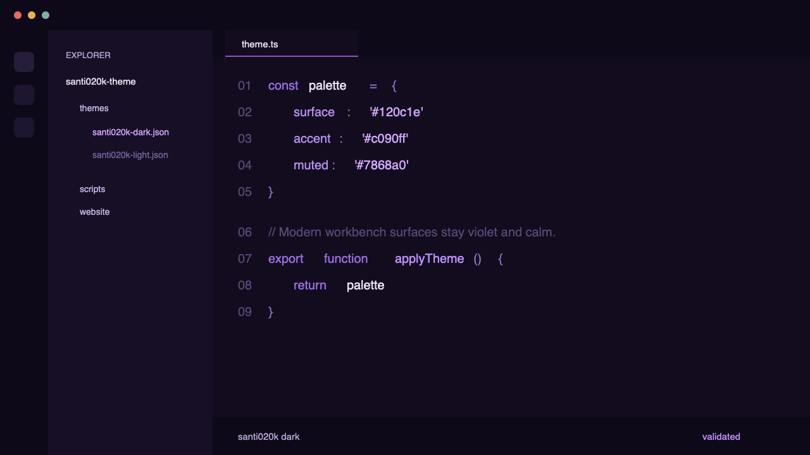
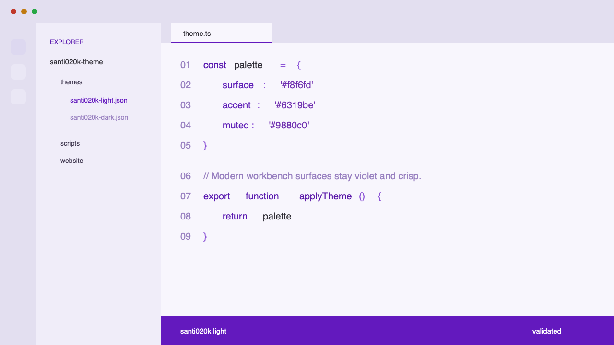
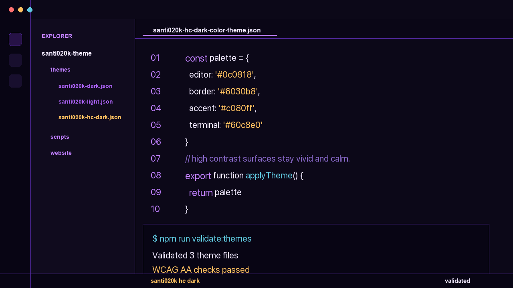
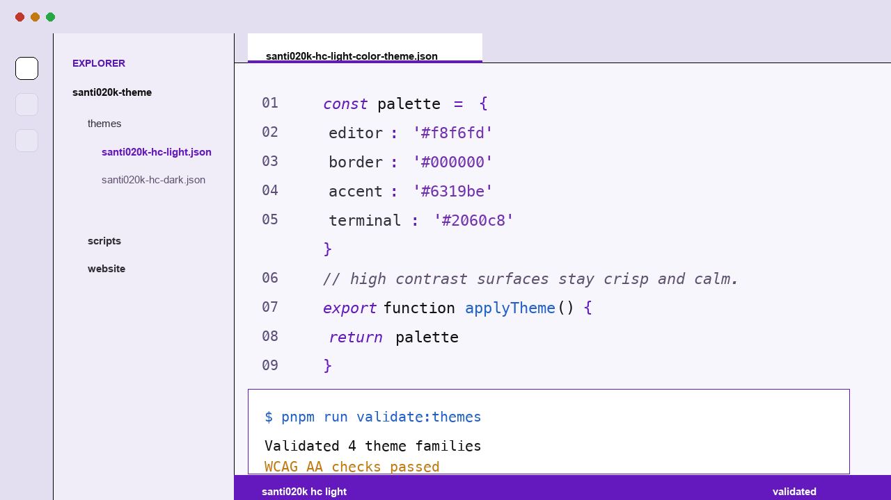

# Santi020k Theme

[](https://marketplace.visualstudio.com/items?itemName=santi020k.santi020k-theme)
[](https://open-vsx.org/extension/santi020k/santi020k-theme)
[](https://github.com/santi020k/santi020k-theme/actions/workflows/validate.yml)

A coordinated VS Code theme family with deep indigo-black dark variants, purple-tinted light variants, high-contrast siblings, and optional bold or italic syntax styles. It is built for long technical sessions: calm contrast, semantic highlighting, and one consistent violet color language.

**Website:** [vscode.santi020k.com](https://vscode.santi020k.com)









## Highlights

- 12 shipped variants across dark, light, high-contrast dark, and high-contrast light profiles.
- Base, bold, and italic styles for different typography preferences.
- Purple-forward accents without neon noise.
- Semantic highlighting enabled for richer editor intelligence.
- Validated theme JSON and marketplace metadata in CI.
- Compatible with VS Code, Cursor, Windsurf, VSCodium, GitHub Codespaces, and other VS Code extension hosts.

## Install

### Visual Studio Marketplace

1. Open Extensions in VS Code.
2. Search for **Santi020k Theme**.
3. Install the extension from publisher `santi020k`.
4. Open the theme picker and choose a variant such as `santi020k dark`, `santi020k light bold`, or `santi020k hc light italic`.

Marketplace listing: [marketplace.visualstudio.com/items?itemName=santi020k.santi020k-theme](https://marketplace.visualstudio.com/items?itemName=santi020k.santi020k-theme)

### Open VSX

Use Open VSX for VSCodium and editors that do not install from the Visual Studio Marketplace.

Open VSX listing: [open-vsx.org/extension/santi020k/santi020k-theme](https://open-vsx.org/extension/santi020k/santi020k-theme)

## Variants

| Variant | UI theme | Notes |
| --- | --- | --- |
| `santi020k dark` | Dark | Deep indigo-black canvas with muted violet accents |
| `santi020k light` | Light | Purple-tinted whites with a stronger violet interaction color |
| `santi020k hc dark` | High contrast dark | Stronger borders and clearer separation on near-black surfaces |
| `santi020k hc light` | High contrast light | White canvas, black structure, saturated syntax accents |
| `santi020k dark bold` | Dark | Dark palette with bold syntax tokens |
| `santi020k light bold` | Light | Light palette with bold syntax tokens |
| `santi020k hc dark bold` | High contrast dark | High-contrast dark palette with bold syntax tokens |
| `santi020k hc light bold` | High contrast light | High-contrast light palette with bold syntax tokens |
| `santi020k dark italic` | Dark | Dark palette with broader italic syntax styling |
| `santi020k light italic` | Light | Light palette with broader italic syntax styling |
| `santi020k hc dark italic` | High contrast dark | High-contrast dark palette with broader italic syntax styling |
| `santi020k hc light italic` | High contrast light | High-contrast light palette with broader italic syntax styling |

## Preview Settings

The screenshots use a ligature-ready editor setup. To get a similar look:

```json
{
  "editor.fontFamily": "'Fira Code', 'Montserrat', monospace",
  "editor.fontLigatures": true,
  "editor.fontWeight": "500",
  "editor.lineHeight": 1.9,
  "editor.letterSpacing": -0.2
}
```

The theme works with any font. These settings only tune the preview style.

## Development

Run commands from the repository root unless you are intentionally working inside this package.

| Command | What it does |
| --- | --- |
| `pnpm --filter santi020k-theme run build` | Generates base, high-contrast, bold, and italic theme files |
| `pnpm --filter santi020k-theme run validate:themes` | Parses and validates the theme files |
| `pnpm --filter santi020k-theme run validate:marketplace` | Checks extension metadata and packaging readiness |
| `pnpm --filter santi020k-theme run package` | Builds a local VSIX with `vsce package --no-dependencies` |
| `pnpm run validate:themes` | Runs the root theme validation shortcut |
| `pnpm run validate` | Runs the full monorepo validation suite |

Generated variants come from scripts in `scripts/`. Avoid hand-editing generated VSIX files or build artifacts.

## Release

Releases are managed by Changesets and published to both the Visual Studio Marketplace and Open VSX.

- Add a patch changeset for fixes and docs.
- Add a minor changeset for new theme coverage or significant capability additions.
- Required publish secrets are `VSCE_PAT` and `OVSX_PAT`.
- The release script is expected to skip versions that are already published.

## Related Packages

- `@santi020k/theme` provides shared assets, design tokens, and Chrome color mapping helpers.
- `@santi020k/theme-core` provides shared token, asset, and website helper functions.
- `santi020k-chrome-theme` ships the matching Chrome browser theme.

## Support

If this theme makes your editor a nicer place to work, you can support ongoing maintenance through [GitHub Sponsors](https://github.com/sponsors/santi020k).

## License

MIT. See the repository [LICENSE](../../LICENSE).
